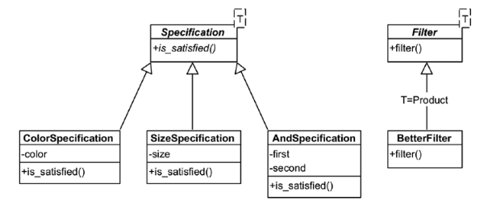

# SOLID Principles

the SOLID acronym stand for following principles :

- [Single Responsibility Principle](#single-responsibility-principle) (SRP)
- [Open-Closed Principle](#open-closed-principle) (OCP)
- [Liskov Substitution Principle](#liskov-substitution-principle) (LSP)
- [Interface Segregation Principle](#interface-segregation-principle) (ISP)
- [Dependency Inversion Principle](#dependency-inversion-principle) (DIP)

## Single Responsibility Principle

> Each class should only have **one responsibility** and therefore has only one reason to change.

```c++
    /* bad example */
    class LightSource {
        virtual void toggle(bool b) = 0;
        /* this should be in a separate render class! */
        virtual void renderPhong() = 0;
        virtual void renderBlinnPhong() = 0;
    };
```

Find good places to separate into modules. An extreme example of an antipattern would be a ***God Object*** that 
tries to handle as many concerns as possible.

## Open Closed Principle

> A type is open for extension but closed for modification.

```c++
    /* this will get huge eventually... */
    class FilterDB {
        void filterA_impl();
        void filterB_impl();
        void filterC_impl();
        void filterD_impl();
    };
    /* A better example */
    template <typename T> struct Specification {
        virtual bool is_satisfied(T* item) = 0;
    };
    template <typename T> struct Filter {
        virtual vector<T*> filter(vector<T*> items, Specification<T>& spec) const = 0;
    };
    struct BetterFilter : Filter<Product> {
        vector<Product*> filter(vector<Product*> items, Specification<Product>& spec) override {
            vector<Product*> result;
            for(auto& p : items) {
                if(spec.is_satisfied(p))
                    result.push_back(p);
                return result;
            }
        }
    };
    /* now easily create custom Specification! */
    struct ColorSpecification : Specification<Product> {
        Color color;
        explicit ColorSpecification(const Color color) : color(color) {}
        bool is_satisfied(Product* item) override {
            return item->color == color;
        }
    };
    /* Create a logical AND Specification to extend the filtering. */
    /* You can also add an overloaded && operator to the global scope */
    template<typname T> struct AndSpecification {
        Specification<T>& first;
        Specification<T>& second;
        AndSpecification(Specification<T>& first, Specification<T>& second)
            : first(first), second(second) { }
            
        bool is_satisfied(T* item) override {
            return first.is_satisfied(item) && second.is_satisfied(item);
        }           
    };
```
Here is a little UML Diagram representing the structure : 



As you can see, our class is now very easy to extend with the use of the Abstract Specification 
class, but the modules themselves are not interchangeable. This also follows the [SRP](#single-responsibility-principle) 
pattern.
> Essentially, OCP suggests that you should not return to code you have already written and tested **(closed)**
> Moreover, it should be easily extensible, as in our example **(open)**

## Liskov Substitution Principle

> An interface that takes an object of type **Parent** should equally take an object of type **Child**.

```c++
    class Parent {
        /* do some parent stuff*/
    };

    class Child : public Parent {
        /* do some child stuff */ 
    };
    
    void evilProcessing(Parent& p) {
        /* do some processing that breaks if called with Child! */
    }
    int main() {
        Child child;
        evilProcessing(child); /* unfortunate stuff about to happen */
    }
```

## Interface Segregation Principle

> Split up interfaces so implementers can choose depending on their needs.

```c++
    /* but I only need C() ... :( */
    class abstractInterface {
        virtual void A() = 0;
        virtual void B() = 0;
        virtual void C() = 0;
    };
    /* split up the interface */
    class abstractA {
        virtual void A() = 0;
    };
    
    class abstractB {
        virtual void B() = 0;
    };
    
    class abstractC {
        virtual void C() = 0;
    };
    
    /* and merged together */
    class mergedInerface : abstractA, abstractB, ... { };
```

## Dependency Inversion Principle

> **A**: High-level modules should not depend on low-level modules. Both should depend on abstractions.

> **B**: Abstractions should not depend on details. Details should depend on abstractions. 
